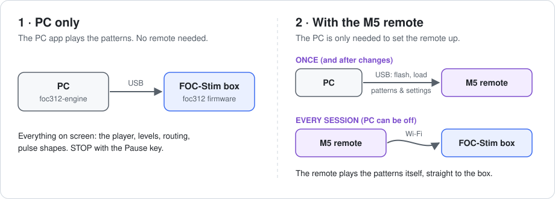
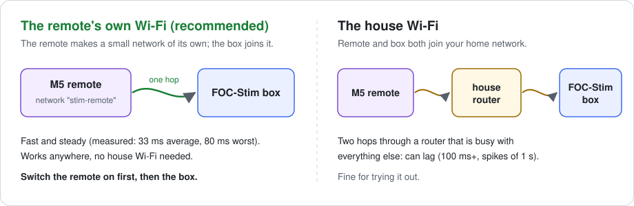
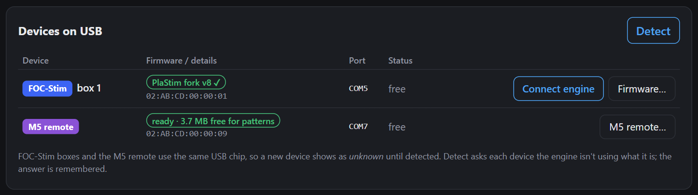
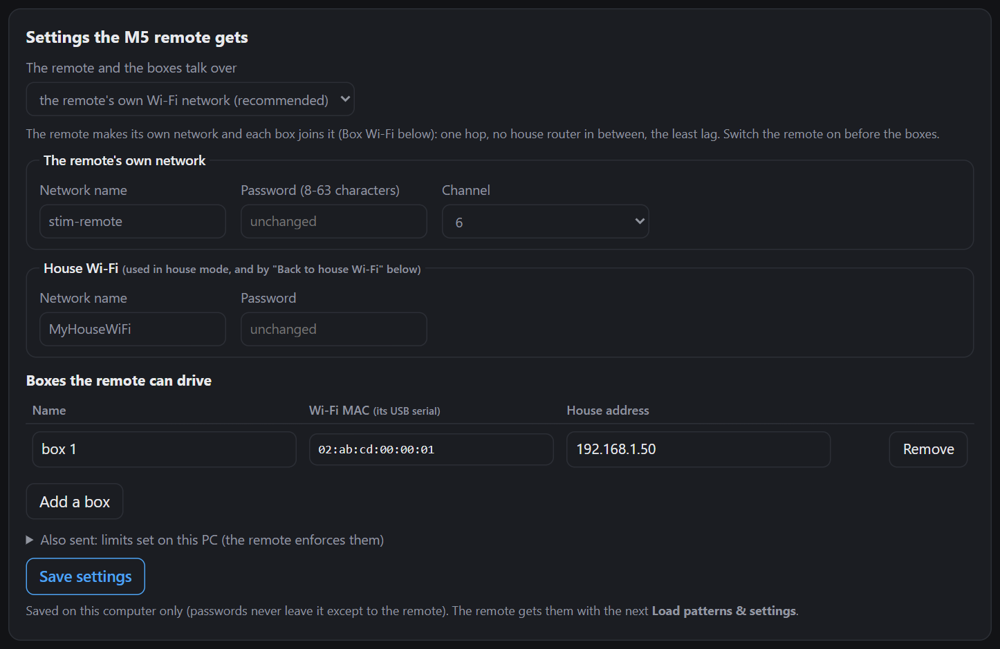
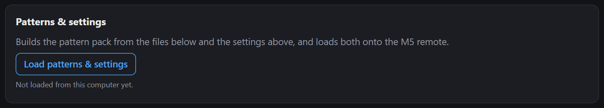
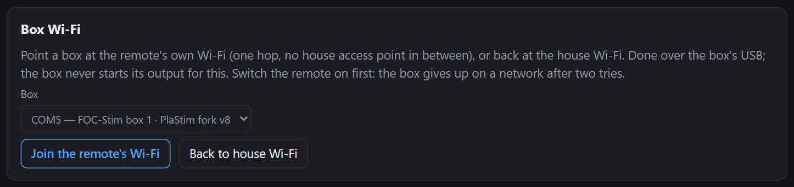

# PlaStim foc312 M5 remote

A handheld controller for **FOC-Stim** boxes running the [foc312](https://github.com/plastim/foc312) firmware. It
plays the same ET-312-style patterns as the [PlaStim foc312 engine](https://github.com/plastim/foc312-engine),
with no computer needed, straight to the box over Wi-Fi.

It runs on the **OSSM M5 Remote** hardware by ortlof: an M5Stack CoreS3 SE on a carrier with four encoders and a
button. Build or buy one from **[ortlof/OSSM-M5-Remote](https://github.com/ortlof/OSSM-M5-Remote)**; this repository
is its firmware for e-stim (written from scratch; the hardware design is ortlof's).

> **Start here:** install the PC app with its
> **[installation guide](https://github.com/plastim/foc312-engine/blob/main/INSTALL.md)**. It flashes this firmware
> onto the remote and loads its patterns and settings ([Setting it up](#setting-it-up), below).

## Two ways to use it



1. **PC only.** The PC app's player drives the box. You don't need the remote at all.
2. **With the M5 remote.** The PC app is only needed to **set the remote up**: put this firmware on it and load the
   patterns and settings. After that the remote works **on its own**. It plays the patterns itself and talks straight
   to the box over Wi-Fi, and the PC can be off or somewhere else. Go back to the PC only to change settings or add
   patterns.

You can switch between the two any time. The box's own knob is the master limit either way.

## Controls

| Control | Main screen | Pattern list | Options (wiring picture) |
|---|---|---|---|
| Knob 1 turn | master volume | scroll | move the highlight |
| Knob 1 press | open patterns | pick | toggle / next |
| Knob 2 turn | MA (the ET-312's sensation knob) | jump 10 | pulse shape |
| Knob 3 / 4 turn | level of each wire pair | - | that pair's wires, both directions |
| Knob 4 press | options | back | back |
| MX button | start / **STOP** | start / STOP | start / STOP |
| Power button | short press: switch off (output stopped first) | | |

In the menus no knob touches the output, and STOP always works. The box's own knob stays the master limit: the
remote's master is a share of it.

### Why flip the polarity?

Each wire pair has a direction: which pad is negative during the first, stronger half of every pulse (on the options
screen, knobs 3 and 4 step through each pair's wires in both directions). **The sensation is strongest under the pad
that is negative in that first half.** So flipping a pair's polarity moves the focus from one pad to the other
without moving anything:
- when one pad feels sharp and the other barely at all, a flip swaps them;
- with pads of different sizes or in different places, one direction usually feels better;
- the change is immediate, so you can compare the two directions back and forth.

The effect is strongest with the lopsided ET-312-style pulses (a short strong half and a long weak one) and smaller
with the even shapes. Either direction is equally safe: every pulse is balanced (the same charge each way), so
nothing builds up under either pad.

## How the remote reaches the box: the Wi-Fi

The remote and the box talk over Wi-Fi, so they have to be on the **same network**. There are two ways to do that:



- **The remote's own Wi-Fi (recommended).** The remote makes a small Wi-Fi network of its own (like a phone
  hotspot), and the box joins it. There's nothing in between, so it's fast and steady, and it works anywhere,
  even with no house Wi-Fi at all.
- **The house Wi-Fi.** The remote and the box both join your home network. That's easy for trying things out, but
  every message goes through a router that's busy with everything else in the house, so the remote can lag.

Two things to know about the box:

- **The box remembers one network.** Telling it which one ("pairing") is done once, over USB (step 5 below).
  After that it looks for that network every time it's switched on.
- **The box only looks for a short while.** It gives up after two tries. So with the remote's own Wi-Fi,
  **switch the remote on first, then the box.** If you did it the other way round, switch the box off and on.

## Setting it up

You need the PC app installed ([installation guide](https://github.com/plastim/foc312-engine/blob/main/INSTALL.md))
and USB data cables for the remote and the box.

**1. Plug in the remote and the box, and press Detect** (hub, **Boxes** tab). Both show up, with the box's firmware
and its Wi-Fi MAC (the long `02:AB:...`-style number, also the box's USB serial number).



**2. Put this firmware on the remote:** **M5 remote** tab, **Check for updates**, pick the newest release, then
**Flash…** and **Flash now**. The remote must be stopped (not playing). This replaces the OSSM firmware the remote
came with (see [Going back](#going-back-to-the-ossm-firmware)).

**3. Fill in the settings the remote gets** (**M5 remote** tab), then press **Save settings**:



- **The remote and the boxes talk over:** choose *the remote's own Wi-Fi network* (recommended) or *the house
  Wi-Fi*.
- **The remote's own network:** a name and a password (8 to 63 characters) that you make up. This is the network the
  remote will create. The **channel** can stay at 6; try 1 or 11 if it's unreliable where you are.
- **House Wi-Fi:** your home network's name and password. It's used in house mode, and to send a box back to the
  house network.
- **Boxes the remote can drive:** press **Add a box** while the box is plugged in and it fills in the MAC itself.
  Give the box a name; that's what the remote shows. The **House address** is only needed in house mode (the box's
  IP address on your network).
- **Also sent:** the safety limits set on the PC (current cap, slow start, deadman). The remote enforces them, and
  they can't be changed on the remote itself.

Passwords stay on this computer; they only go to the remote itself. Afterwards, the password boxes show *unchanged*.

**4. Load everything onto the remote:** press **Load patterns & settings**. Do this again whenever you change a
setting or add patterns.



**5. Pair the box to the remote's Wi-Fi** (only for *the remote's own Wi-Fi*). Switch the remote **on** first, with
the box plugged in by USB. In **Box Wi-Fi**, pick the box and press **Join the remote's Wi-Fi**. **Back to house
Wi-Fi** undoes it. The box's output never starts during this.



**6. Use it.** Unplug everything. Switch the **remote on first, then the box**, pick the box in the remote's
options, choose a pattern, turn the box's own knob low, and press the MX button to start. The PC can be off.

## Doing it yourself, without the hub

Everything the hub does can be done by hand.

**Flash the remote with esptool.** Download the `.bin` from the newest
[release](https://github.com/plastim/foc312-m5remote/releases), then run:

```powershell
python -m pip install esptool
python -m esptool --chip esp32s3 --port COMx --baud 921600 write-flash 0x0 stim-remote-XXXXXXX.bin
```

`COMx` is the remote's port. The file is the complete image, starting at `0x0`. Patterns and settings already on
the remote are kept. The hub checks the release's signature for you; by hand, compare the file's SHA-256
(`certutil -hashfile <file> SHA256`) with the one in the release's `manifest.json`. If esptool can't connect, hold
the remote's reset button for about 3 seconds (download mode) and run it again. If the screen stays black
afterwards, press reset once.

**Point the box at the remote's Wi-Fi with restim.** In [restim](https://github.com/diglet48/restim), with the box
plugged in by USB:
1. Open **Tools → Preferences → FOC-Stim**.
2. Choose the box's serial port.
3. Type the remote's network name as **SSID**, and its password.
4. Press **Upload ssid/password**.

To go back to your house network, upload that network's name and password the same way. Switch the remote on first,
so the box finds the network. The remote still needs the box's MAC in its settings (step 3): that's how it finds the
box on its own network.

**Load patterns and settings from the command line** (in the PC app's folder, after editing `config/m5.toml`; see
`config/m5.example.toml`):

```powershell
.\venv\Scripts\python.exe -m stimengine.remote load --port COMx
.\venv\Scripts\python.exe -m stimengine.remote pair-box --box-port COMy     # --house to go back
```

### Going back to the OSSM firmware

Flash ortlof's firmware from [ortlof/OSSM-M5-Remote](https://github.com/ortlof/OSSM-M5-Remote) the way that project
describes. This remote firmware can be put back on any time.

## Safety

The remote runs the same safety stack as the PC engine:
- a hard current cap;
- a slow start every time you start;
- a rate limit on turning up (turning down is instant);
- STOP, which always wins.

If the Wi-Fi link drops, the box stops by itself within seconds. If the box trips, the remote shows the box's trip
report; power-cycle the box and start from zero. Read the safety notes in the
[engine's README](https://github.com/plastim/foc312-engine#safety).
**This is not a medical device. You use it at your own risk.**

## Building

```
cd m5
pio run -e app -t upload --upload-port COMx
```

`core/` is portable C99 with no allocation (the ET-312 emulator, the safety stack, the box link); it is tested on
the PC against the Python engine by the engine's test suite. `tools/package_m5.py` makes the release image.

## License and credits

[PolyForm Noncommercial 1.0.0](LICENSE.md); third-party parts in `NOTICE`. Hardware:
[ortlof/OSSM-M5-Remote](https://github.com/ortlof/OSSM-M5-Remote) (CC BY-SA 4.0).

Support the project: [Patreon](https://www.patreon.com/plastim) · [PlaStim store](https://plastim.net/)
